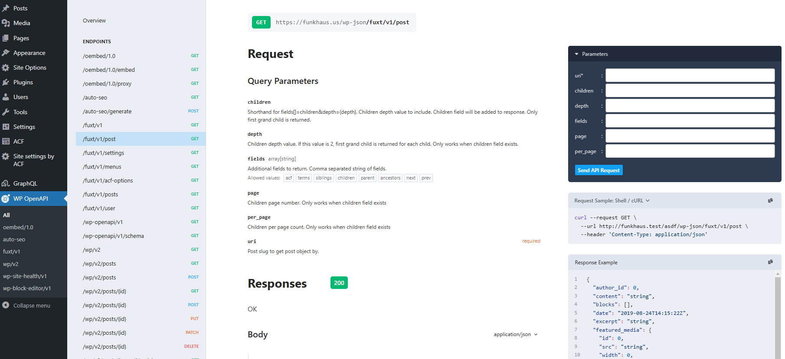

# Fuxt API Plugin

## Description

The Fuxt API Plugin is a custom WordPress plugin designed to extend the functionality of your WordPress site by providing additional API endpoints. This plugin is tailored to meet the specific needs of the Funkhaus project.

## Installation

1. Download the plugin files.
2. Upload the `fuxt-api` folder to the `/wp-content/plugins/` directory.
3. Activate the plugin through the 'Plugins' menu in WordPress.

## Usage

Once activated, the plugin will automatically add new API endpoints to your WordPress site. You can access these endpoints via the WordPress REST API.

## Endpoints

-   `/wp-json/fuxt/v1/post?uri={post_uri}` - Get post data by post uri.
-   `/wp-json/fuxt/v1/posts` - Get posts.
-   `/wp-json/fuxt/v1/user` - Get current user data.
-   `/wp-json/fuxt/v1/menus?name={menu_name}` - Get menu by name.
-   `/wp-json/fuxt/v1/settings` - Get site settings.
-   `/wp-json/fuxt/v1/acf-options?name={option_name}` - Get acf option by name.

You can install the [WP OpenAPI](https://wordpress.org/plugins/wp-openapi/) plugin. This will allow you to get the endpoint details (request parameters and response data schema) at /wp-admin/admin.php?page=wp-openapi.

## Contributing

1. Fork the repository.
2. Create a new branch (`git checkout -b feature-branch`).
3. Make your changes.
4. Commit your changes (`git commit -am 'Add new feature'`).
5. Push to the branch (`git push origin feature-branch`).
6. Create a new Pull Request.

## License

This project is licensed under the MIT License. See the [LICENSE](LICENSE) file for details.

## Contact

For any questions or issues, please contact the development team at [support@funkhaus.com](mailto:support@funkhaus.com).
